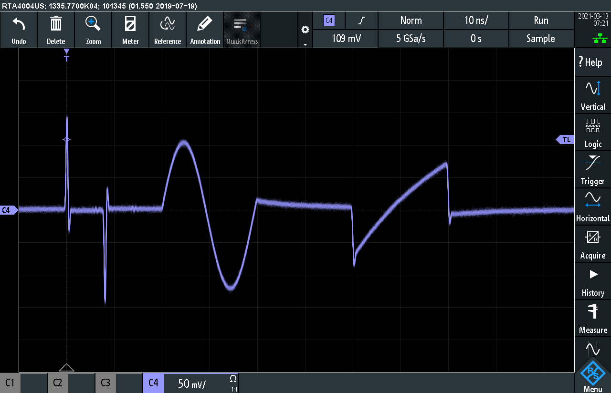

# AD9174 demo project
Get the `AD9174-FMC-EBZ` demo board running on a `vc707`.

# Install
  First install litex according to:
  https://github.com/enjoy-digital/litex#quick-start-guide

  Then replace the jesd204b/ library with my forked version

  ```bash
  cd litejesd204b/
  git remote add fork https://github.com/yetifrisstlama/litejesd204b.git
  git fetch fork
  git checkout -b fork fork/master
  pip3 install -e .
  ```

# Internal clocking setup
Uses the on-board 122.88 MHz crystal oscillator + 2 x PLL in the HMC7044 + PLL in the AD9174 to generate a DAC sampling clock.


# External clocking setup
Uses an external (very high quality) signal source directly as the DAC sampling clock.


# Building and initializing the AD9174

```bash
# Build a bit-file for the vc707
python3 top.py --csr-csv build/csr.csv --csr-json build/csr.json --f_dsp 307200000 --build
# build/csr.json contains the litex register map

# Load the bit-file over the vc707 USB-jtag port
python3 top.py --load

# GPIO LEDS: 2: tx_clk, 1: sys_clk, 0: jsync status
# At least the sys_clk one should blink at 1 Hz

# Start litex server on the vc707 USB-uart port
litex_server --uart --uart-port /dev/ttyUSB2 --uart-baudrate 115200

# Open `spi/setup_internal_clock.ipynb` in jupyter notebook
# to interact with the FPGA
cd spi
jupyter notebook
```

# Arbitrary Waveform Generator mode
  * clocked by external 5 GHz source
  * JESD mode = 20: FPGA provides a real-valued sample stream. 
  * `f_dsp_clk = 312.5 MHz`: 16 samples per FPGA clock 
  * See [setup script](spi/setup_external_clock.ipynb)



# See also
  * [Spreadsheet](https://docs.google.com/spreadsheets/d/1F6s6cVM1Lo6IOUgZoq9xm0ueGYkePZFeD96N0-kPR9o/edit#gid=0) with supported JESD modes and clock rates for AD9174
